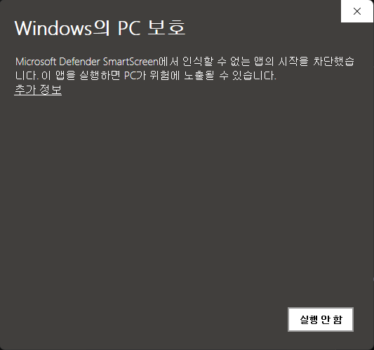
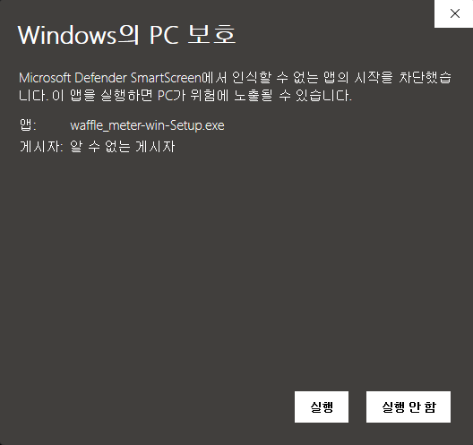

# waffle_meter

아이온2 전투분석을 위한 미터기 프로젝트 (v2.0 — 네이티브 WPF/.NET 재작성)

- Spoqa Han Sans Neo, Freesentation, Pretendard (OFL 1.1)
- NEXON Lv2 Gothic, Tmoney Round Wind (Custom License)

해당 프로젝트는 아이온2 운영측의 요청, 패킷암호화등의 조치, 공식적인 사용중단 언급이 있다면 중지 및 비공개상태로 전환됩니다.

## 사용법

1. [Releases](https://github.com/Waffle-ens/waffle_meter/releases)에서 최신 설치 파일(`waffle_meter-win-Setup.exe`)을 받아 실행합니다.
   패킷 캡처 드라이버(WinDivert)가 내장되어 있어 **Npcap 등 별도 설치가 필요 없습니다.** (드라이버가 차단되는 환경에서는 설정에서 Npcap 백엔드로 전환할 수 있습니다.)

   > ⚠️ 설치 파일을 처음 실행하면 **"Windows의 PC 보호"** 경고가 뜰 수 있습니다(코드 서명 평판이 쌓이기 전 단계). 1회성이며, 아래 순서로 실행하면 됩니다.
   >
   > 
   >
   > **추가 정보**를 누르면 아래처럼 **실행** 버튼이 나타납니다. (게시자가 "알 수 없는 게시자"로 표시돼도 정상입니다.)
   >
   > 

2. 설치 후 시작 메뉴의 `waffle_meter`를 실행합니다.
   처음 실행 시 패킷 캡처를 위해 권한 상승 동의(UAC)가 **한 번만** 표시되며, 이후 실행부터는 다시 묻지 않습니다.

3. 아이온2에 접속해 전투를 시작하면 데미지 기록·전투 기록·파티 신청 패널이 인게임 오버레이로 표시됩니다.

4. 미터기 위치가 화면 밖이면 설정 → 위치 초기화로 되돌릴 수 있습니다.

5. 업데이트는 앱이 자동으로 확인합니다. 알림의 **"지금 재시작"**을 누르면 자동으로 적용되고 한 번 재시작됩니다. (수동 재설치 불필요)

> v1.x(MSI) 사용자: v2.0 설치 시 기존 버전은 자동으로 정리되어 중복 설치되지 않습니다.

## 코드 서명 (Code signing)

This project uses free code signing provided by [SignPath.io](https://signpath.io) and a free code signing certificate by the [SignPath Foundation](https://signpath.org).

배포 파일은 [SignPath.io](https://signpath.io)의 무료 코드 서명과 [SignPath Foundation](https://signpath.org)의 무료 코드 서명 인증서를 사용합니다.

## 업데이트 기록

- v2.4.0 (2026-06-26)
  - [추가] 알림 기능: 슈고 페스타(매시 정각) 리마인더 + 사용자 커스텀 알람(시·분·요일 반복). 설정에 "알림" 탭이 생겼고 알림음·음량·소리 테스트를 제공합니다.
  - [개선] 닉네임에 글꼴이 표현하지 못하는 한글(외자·희귀 글자)이 있어도 깨지지 않고 안전한 글꼴로 표시됩니다.
  - [수정] 8인 공대 등에서 전투 종료 후 한 참가자의 이름·서버·직업·전투력이 다른 사람으로 바뀌어 표시되던 문제를 수정했습니다. (히스토리는 정상 · 라이브 화면 표시만 영향)

- v2.3.3 (2026-06-24)
  - [수정] 8인 공대 전투를 통계 웹에 업로드할 때 본인(업로더)의 파티 구분이 누락되어 v2.3.2 이후에도 파티 구분이 완성되지 않던 문제를 수정했습니다. (던전을 여러 번 드나든 뒤 공대 진행 시 본인 슬롯이 누락되던 문제 · 미터기 화면 표시는 변경 없음 · 4인 이하 파티는 영향 없음)

- v2.3.2 (2026-06-24)
  - [수정] 8인 공대 전투를 통계 웹에 업로드할 때 참가자의 파티 구분(1파티/2파티)이 대부분 누락되던 문제를 수정했습니다. (v2.3.0에서 추가된 기능이 실제로는 거의 채워지지 않던 문제 · 미터기 화면 표시는 변경 없음 · 4인 이하 파티는 영향 없음)

- v2.3.1 (2026-06-23)
  - [수정] 전멸 후 다시 전투를 시작했을 때 전투 진행 중 DPS가 실제보다 낮게 표시되다가 전투가 끝나면 정상으로 바뀌던 문제를 수정했습니다. 이제 전투 중에도 올바른 DPS가 표시됩니다(전투 종료 후 기록 값은 기존과 동일).

- v2.3.0 (2026-06-22)
  - [변경] 8인 공대 전투를 통계 웹에 업로드할 때 각 참가자의 파티 구분(1파티/2파티) 정보를 함께 보냅니다. (미터기 화면 표시는 변경 없음 · 웹 통계의 파티별 표시에 사용 · 4인 이하 파티는 영향 없음)

- v2.2.1 (2026-06-19)
  - [수정] '내 캐릭터 관리' 목록에서 이름 없는 옛 기록이 "이름 없음 (이전 기록)"으로 표시되던 문제를 수정했습니다. 캐릭터 접속·인식 시 이름과 함께 표시됩니다(동의 기록은 그대로 유지).

- v2.2.0 (2026-06-19)
  - [추가] 캐릭터별 공개·동의 관리: 공개 설정 탭에서 동의한 내 캐릭터 목록 확인·캐릭터별 공개 토글·동의 철회.
  - [추가] 전투 전 파티 미리보기에 내 캐릭터도 함께 표시합니다.
  - [수정] 전투 초기화 시 인식된 내 캐릭터 정보를 유지합니다(전투 기록만 초기화). 맵 이동 없는 던전에서도 초기화 후 정상 동작합니다.
  - [수정] 같은 보스를 다시 잡을 때 간혹 이전 전투 기록에 멈춰 있던 문제를 수정했습니다.
  - [수정] 던전 중 본인 식별 정보가 늦게 도착(인스턴스 변경 등)해 본인 행이 빠지던 경우를 보강했습니다.
  - [수정] 캐릭터 정보를 못 가져온 빈 행 표시, 마을 초기화 후 이전 파티 잔류, 전투 전 본인 중복 표시 문제를 수정했습니다.
  - [수정] '내 캐릭터 관리' 목록에서 접속했던 캐릭터 이름이 표시되도록 했습니다(닉네임은 로컬 전용, 업로드 안 됨).
  - [변경] 전투 기록을 최대 30개까지 보관하고, 기록 창을 일정 높이로 제한해 스크롤로 다시 볼 수 있습니다.

- v2.1.0 (2026-06-18)
  - [추가] 던전 입장 시 전투 시작 전에도 파티·공대원을 미리 표시합니다. 첫 피해가 들어오면 자동으로 전투 화면으로 전환됩니다. (설정 → 화면 → '전투 전 파티원 표시'에서 끌 수 있음)
  - [추가] '내 캐릭터 통계 보기'를 추가했습니다. 공개 설정 탭의 버튼으로, 내가 올린 전투 기록만 통계 사이트에서 모아 볼 수 있습니다. (닉네임·서버 비공개, 미터기 재설치·다른 PC·과거 전투 포함)
  - [추가] 공개 설정(익명 통계) 탭에 도움말(?)을 추가해 스위치·버튼의 동작을 한 번에 설명합니다.
  - [수정] 일부 플레이어의 직업 아이콘이 간혹 실제와 다르게 표시되던 문제를 보강했습니다.
  - [수정] 진행 중인 파티에 중간 합류(난입)했을 때 첫 보스 전투에서 본인 DPS가 집계되지 않던 문제를 수정했습니다.

- v2.0.11 (2026-06-17)
  - [수정] 게임이 활성화된 상태에서도 가끔 오버레이가 사라지던 문제를 개선했습니다. 오버레이 표시 방식을 재설계해(항상 위 유지 + 숨김은 투명 처리) 게임 복귀 시 더 안정적으로 표시됩니다. (전체 화면 독점 모드는 OS 특성상 제외)
  - [수정] VPN·게임 부스터 사용 시 같은 패킷이 중복 집계되어 DPS가 실제보다 부풀려지던 문제를 해결했습니다.
  - [수정] '직업 강조' 모드에서 전투 종료(대기 중) 후 내 캐릭터 바 색이 직업색으로 풀리던 문제를 해결했습니다. 전투 기록처럼 전투 후에도 '내 캐릭터' 색을 유지합니다.
  - [수정] 설정 버튼을 여러 번 누르면 설정 창이 겹쳐 열리던 문제를 해결했습니다. 한 번 더 누르면 열린 창이 닫힙니다.

- v2.0.10 (2026-06-16)
  - [수정] 단축키로 미터기를 숨긴 뒤 같은 단축키로 다시 표시되지 않던 문제를 해결했습니다. 길게 누르거나 빠르게 반복해도 한 번만 토글되도록 하고 표시 상태를 정확히 추적합니다. (트레이로 다시 표시하는 기능은 영향 없음)

- v2.0.9 (2026-06-16)
  - [수정] 끝난(저장된) 전투·기록(히스토리) 재생에서 '직업 강조' 모드의 내 캐릭터 바가 직업색으로 보이던 문제를 해결했습니다. 저장 전투에 본인 정보를 함께 기록해 다시 볼 때도 '내 캐릭터' 색이 우선합니다. (v2.0.8의 후속 보강)
  - [개선] 보스 체력 게이지도 '게이지 형태' 옵션(칸 채우기 / 얇은 바 / 없음)을 따릅니다. (이전에는 항상 얇은 막대)

- v2.0.8 (2026-06-15)
  - [수정] 풀스크린 게임에서 돌아왔을 때 미터기가 게임 뒤에 가려져 안 보이고 트레이를 건드려야 나타나던 문제를 근본 해결했습니다. (작업표시줄 숨김이 만든 숨은 소유 창 원인 제거)
  - [수정] 기록(히스토리)에서 저장된 전투를 다시 열어 상세를 볼 때 아주 가끔 누적 피해량·비율·스킬이 전부 0/빈칸으로 뜨던 문제를 해결했습니다. 이제 보고 있는 전투 기준으로 올바르게 표시하고, 데이터가 없으면 '데이터 없음'으로 안내합니다.
  - [수정] '직업 강조' 색상 모드에서 직업별 색을 바꾸면 내 캐릭터 바도 직업색을 따라가던 문제를 해결했습니다. 본인으로 인식되면 '내 캐릭터' 색이 직업색보다 우선합니다.
  - [수정] 같은 파티원의 직업이 실제와 다르게(예: 살성→궁성) 표시되고 전투 후에도 유지되던 문제를 해결했습니다. 실제 사용한 직업 전용 스킬을 최우선 근거로 직업을 교정합니다.

- v2.0.7 (2026-06-14)
  - [수정] 파티 신청·전투 기록 패널과 전투 상세 창도 게임으로 돌아오면 미터기와 함께 항상 위로 올라오도록 했습니다. (이전에는 메인 미터만 복구됨)
  - [수정] 헤더 버튼에 마우스를 올린 직후 Alt+Tab 하면 미터기가 한동안 게임 뒤에 가려지던 문제를 해결했습니다. 게임에 포커스가 돌아오는 즉시 위로 올라옵니다.
  - [수정] 전투 상세의 버프/디버프 가동률이 실제보다 낮게 표시되던 문제를 해결했습니다. (전투 종료 후·기록에서도 웹 통계와 동일한 값으로 표시)
  - [추가] 더 두꺼운 글꼴 (EX) 4종을 추가했습니다: NEXON Lv2 Gothic (EX), Pretendard (EX), Spoqa Han Sans Neo (EX), Freesentation (EX).

- v2.0.6 (2026-06-14)
  - [수정] 방송 송출·P2P 등 다른 프로그램이 네트워크를 크게 점유하는 중에도 전투 데미지/DPS가 정상 집계되도록 개선했습니다. (대용량 트래픽이 캡처를 포화시켜 미터기가 "전투 대기 중"에 멈추던 문제)
  - [수정] 미터기가 여러 개 실행되어 한쪽에 "캡처 시작 실패"가 뜨던 문제를 해결했습니다. 트레이로 내려가거나 숨겨진 상태에서 다시 실행하면 새 창을 띄우지 않고 실행 중인 미터기를 복원하며, 이미 실행 중이면 그 사실을 바로 안내합니다.
  - [수정] 미터기가 게임 뒤로 가려져 보이지 않거나 깜빡이던 문제, 오래 켜 두면 시스템이 느려지던 현상, Alt+Tab 복귀 후 바로 표시되지 않던 문제를 해결했습니다.
  - [수정] 파티 신청 패널의 닫기 버튼·보강된 스킬 배지 표시 문제를 고쳤습니다.
  - [추가] 미터 막대 색상 방식 선택('본인 강조' / '직업 강조'), 메인 행 [서버] 약칭 표기 토글, 파티 신청 패널 자동 표시 끄기 토글을 추가했습니다.

- v2.0.5 (2026-06-13)
  - [수정] 일부 상황에서 클래스 아이콘이 잘못 표시되던(예: 수호성→호법성/치유성) 문제를 해결했습니다. 잘못 잡힌 직업이 계속 고정되던 현상을 막았습니다.
  - [수정] "작업표시줄/Alt+Tab 모드"와 "아이온 활성화 시 표시"가 충돌해 Alt+Tab 시 미터기가 깜빡이거나 사라지던 문제를 해결했습니다. (작업표시줄 모드는 노출만 제어, 표시/숨김은 "아이온 활성화 시 표시"를 따름)
  - [추가] '무스펠의 성배(보통)' 보스(이스카리엘·칼드릭스)를 인식하도록 보스 데이터를 추가했습니다.
  - [변경] 업데이트 알림 자동 팝업을 제거하고, 헤더 업데이트 배지로 원할 때 적용하도록 변경했습니다.

- v2.0.4 (2026-06-12)
  - [수정] 멀티 모니터·모니터 분리·해상도 변경 등으로 미터기 창이 화면 밖으로 사라지던 문제를 해결했습니다. 시작·화면 변경 시 보이는 위치로 되돌립니다.
  - [수정] "아이온 활성화 시 표시" 사용 중 게임 플레이 도중(특히 안티치트 환경) 미터기가 깜빡이거나 사라지던 문제를 보강했습니다.
  - [추가] 클릭스루 모드가 켜져 있으면 헤더에 노란 자물쇠 아이콘을 표시합니다.
  - [변경] 미터 숫자를 고정폭으로 표시하고 점유율을 가운데 정렬해 정렬 흔들림을 다듬었습니다.
  - [변경] 설정 창의 중복된 투명도 슬라이더를 제거했습니다. (미터기 헤더 슬라이더로 조절)

- v2.0.3 (2026-06-12)
  - [수정] 관리자 권한으로 실행해야만 캡처가 되던 "캡처 헬퍼 연결 실패" 문제를 해결했습니다. 이제 일반 실행에서도 권한 상승된 캡처 헬퍼에 정상 연결됩니다.

- v2.0.2 (2026-06-12)
  - [수정] 일부 VPN·게임 가속기(부스터)·보안 프로그램 사용 환경에서 캡처 헬퍼 연결이 실패하던 문제를 보강했습니다. (헬퍼 차단 시 권한 상승 재시도 + 허용 목록 안내, 드라이버 차단 안내 추가)

- v2.0.1 (2026-06-12)
  - [수정] 설정 창 하단의 버전 표기가 이전 1.x 버전으로 잘못 보이던 문제를 수정했습니다. 이제 실제 설치된 빌드 버전이 표시됩니다.

- v2.0.0 (2026-06-12)
  - [변경] JavaFX/WebView 기반에서 네이티브 WPF/.NET으로 전면 재작성했습니다. 인게임 프레임 방어와 반응성이 개선되었습니다.
  - [변경] 패킷 캡처 드라이버(WinDivert)를 내장해 Npcap 별도 설치가 필요 없습니다. (필요 시 설정 > 고급에서 Npcap 백엔드로 전환)
  - [추가] 인앱 자동 업데이트(Velopack)를 적용해 수동 재설치 없이 업데이트됩니다. 업데이트 알림에서 "지금 재시작"을 누르면 적용됩니다.
  - [변경] 권한 상승 캡처 헬퍼를 별도 프로세스로 분리하고, 최초 1회만 권한 상승에 동의하면 이후에는 프롬프트 없이 실행됩니다.
  - [변경] 기존 v1.x(MSI) 설치는 v2.0 설치 시 자동으로 정리되어 중복 설치되지 않습니다.
  - [추가] 굵은 글꼴 5종을 추가하고, 기본 글꼴을 NEXON Lv2 Gothic Medium으로 변경했습니다.
  - [추가] 게이지 형태(칸 채우기·얇은 바·표시 안 함) 선택과 미터기 자동 높이 조절을 추가했습니다.
  - [수정] 상세내역·버프/디버프·패널·테마·스크롤바 등 UI 전반을 다듬었습니다.

- v1.4.10
  - 초월 단계별 크로메데 던전 보스 코드 누락을 보강했습니다.
  - 로타르, 롭스티노, 크로메데의 심연의 `231/232/233` 단계 접두 코드가 보스 전투로 인식되도록 추가했습니다.

- v1.4.9
  - JavaFX WebView 환경에서 상세내역/버프/디버프 아이콘이 fallback으로 표시되던 문제를 수정했습니다.
  - 스킬 아이콘 최적화 포맷을 48px WebP에서 48px PNG로 변경해 앱 내장 브라우저 호환성을 높였습니다.
  - 아이콘 lazy loading 구조는 유지해 필요한 시점에만 이미지를 로드하도록 했습니다.

- v1.4.8
  - DPS 계산/React polling 주기를 500ms로 맞춰 불필요한 갱신 비용을 줄였습니다.
  - 전투 기록은 최근 6개만 유지하도록 제한했습니다.
  - 배포용 설정에서 패킷 진단 로그 UI를 제거하고, 개발용 브랜치에만 유지하도록 분리했습니다.
  - 스킬 아이콘을 48px WebP로 최적화하고 필요한 순간에만 로드하도록 변경했습니다.
  - 전투 종료 시 스킬 상세/버프 가동률 요약을 저장하고 원본 패킷/버프 이벤트 누적을 줄였습니다.
  - 상세내역 스킬 피해량에서 연계기는 메인 스킬에 합산 표시하고, 펼치면 메인/연계기 피해량을 나눠 볼 수 있도록 개선했습니다.

- v1.4.7
  - 공식 가이드북과 인게임 확인 기준으로 스킬명-아이콘 매핑을 재정리했습니다.
  - 연계 후속기 스킬 아이콘을 코드별로 추가하고, 같은 base 코드 안의 연계기는 정확한 스킬 코드 아이콘을 우선 사용하도록 수정했습니다.
  - 수호성 `충격 적중`, `생존 의지` 아이콘을 동일 아이콘을 쓰는 직업군 기준으로 보강했습니다.
  - 개발 미리보기 상세내역에서 8개 직업을 각각 확인할 수 있도록 유저별 상세 스킬 데이터를 분리했습니다.

- v1.4.6
  - 로타르, 롭스티노, 크로메데의 심연 보스 코드를 추가해 해당 던전 전투가 미터기에 잡히지 않던 문제를 수정했습니다.
  - 설정 패널에 패킷 진단 로그 시작/종료 기능을 추가해 특정 던전/패킷 파서 문제를 추적할 수 있도록 했습니다.

- v1.4.5
  - 메인 미터기 목록의 누적 피해량 표시 칸을 전투력 표시로 변경했습니다.
  - DPS 단위를 `숫자/초`에서 `숫자/s` 형식으로 정리했습니다.
  - 파티 신청 카드와 메인 목록의 전투력 표기 포맷을 동일하게 맞췄습니다.

- v1.4.4
  - 트레이 아이콘과 설치 패키지 아이콘에 사용하는 와플 로고 리소스를 새 파일로 교체했습니다.
  - 앱 내부 기본 버전 값을 최신 릴리스 기준으로 정리했습니다.

- v1.4.3
  - 보스 HP 패킷에서 관측된 최고 HP를 최대 HP로 누적 저장하도록 수정했습니다.
  - 같은 몹 인스턴스 정보가 다시 저장될 때 기존 최대 HP가 초기화되지 않도록 보강했습니다.
  - 전투 종료 직전 마지막 HP 정보를 전투 리포트에 반영해 타겟 HP가 `0 / 0%`로 표시되는 문제를 수정했습니다.

- v1.4.2
  - 타겟 인식 실패 상태에서 임시 숫자 유저가 미터 목록에 표시되지 않도록 필터링했습니다.
  - 소환수/정령 계열 피해가 가능한 경우 실제 소유자에게 귀속되도록 보강했습니다.
  - 지속 피해 효과 코드가 실제 스킬명/아이콘으로 표시되도록 스킬 코드 정규화를 개선했습니다.
  - 상세내역 버프 가동률에서 내부 더미 버프를 숨기고, 효과 코드는 실제 스킬명/아이콘으로 보정했습니다.

- v1.4.1
  - 설정에서 다중 모니터 이동 모드를 켜고 끌 수 있도록 추가했습니다.
  - 다중 모니터 이동 모드에서 보조 모니터 영역까지 미터기/패널을 이동할 수 있도록 오버레이 범위를 확장했습니다.
  - 모드 전환 시 기존 위치가 튀지 않도록 좌표 보정을 추가했습니다.

- v1.4.0
  - 미터기 UI를 새 디자인으로 정리했습니다.
  - 트레이/설치 아이콘과 스킬/버프 아이콘 리소스를 보강했습니다.
  - 상세내역 미리보기의 스킬명/스킬 아이콘 표시를 실제 데이터 구조에 맞게 수정했습니다.

- v1.3.2
  - 자동 숨김 상태에서 투명 오버레이가 작업표시줄 위에 남지 않도록 보강했습니다.
  - 아이온2 포커스가 아닐 때 오버레이의 항상 위 상태를 해제하고 뒤로 보내도록 조정했습니다.

- v1.3.1
  - 업데이트 창 헤더의 투명도 조절 UI를 제거하고 닫기 버튼을 고정 배치했습니다.
  - 릴리스 MSI 파일명과 앱 표시명을 `waffle_meter.v1.3` 기준으로 정리했습니다.

- v1.3.0
  - 화이트 모드 상세내역 대비를 개선했습니다.
  - 트레이/설치 아이콘과 스킬 아이콘 리소스를 보강했습니다.
  - 미터 투명도 설정을 하나로 통합했습니다.
